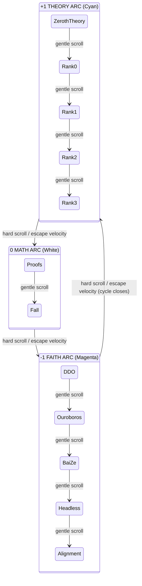

# Physics-Based Cosmic Track Navigation

## Core Concept

The user is a floating entity on a closed-loop cosmic track. They have momentum from scroll/swipe input. They are gravitationally attracted to the nearest **section** (which orbits within its **arc**). Gentle scrolls cycle between sections within the current arc. Hard scrolls break the arc boundary and fling the user into the next arc. The three arcs correspond to the Ternary States: +1 Theory (cyan), 0 Math (white), -1 Faith (magenta).




## Architecture -- Three Layers

### Layer 1: Physics Engine (new file `useTrackPhysics.ts`)

A custom React hook that owns all navigation state and physics simulation. No drei ScrollControls.

**State (in a `useRef`):**

- `t` -- position on the track (0.0 to 1.0, wrapping)
- `velocity` -- current momentum from scroll input
- `nearestSection` -- index 0-11 of gravitationally locked section
- `currentArc` -- 0 (theory), 1 (math), 2 (faith)

**Physics constants:**

- `SECTION_GRAVITY = 0.03` -- pull toward nearest section center
- `ARC_BARRIER = 0.06` -- extra pull at arc boundaries (resist crossing)
- `FRICTION = 0.92` -- velocity decay per frame
- `SCROLL_SENSITIVITY = 0.00015` -- wheel deltaY to velocity
- `ESCAPE_THRESHOLD = 0.008` -- velocity needed to break arc barrier

**Per-frame tick (called from `useFrame`):**

1. Apply friction: `velocity *= FRICTION`
2. Find nearest section: `round(t * 12) % 12`
3. Compute gravity pull toward nearest section center: `sectionT = nearestSection / 12`
4. If `|velocity| < ESCAPE_THRESHOLD`: apply section gravity + arc barrier gravity
5. If `|velocity| >= ESCAPE_THRESHOLD`: free flight, no gravity (escaping)
6. Update position: `t = (t + velocity + 1) % 1`
7. Derive `currentArc` from `t` (0-0.417 = theory, 0.417-0.583 = math, 0.583-1.0 = faith)

**Input capture:**

- `wheel` event: `velocity += deltaY * SCROLL_SENSITIVITY`
- Touch: track touch start Y, compute swipe velocity on touchmove/touchend

### Layer 2: Track Geometry + Camera (rewrite `SceneContent` in [components/Visuals.tsx](components/Visuals.tsx))

**Cosmic ring** -- `THREE.CatmullRomCurve3` closed loop with 12 control points at radius ~100.

**Camera follows physics `t`:**

```typescript
const pos = track.getPointAt(physics.t);
const lookTarget = track.getPointAt((physics.t + 0.008) % 1);
camera.position.copy(pos);
camera.lookAt(lookTarget);
```

**Orbiting sections** -- Each section exhibit orbits slowly around its station point within its arc:

```typescript
const baseT = i / 12;
const basePos = track.getPointAt(baseT);
const orbitAngle = clock.elapsedTime * 0.15 + (i * 0.5);
const orbitR = 3;
const orbitOffset = new THREE.Vector3(
    Math.cos(orbitAngle) * orbitR,
    Math.sin(orbitAngle * 0.7) * 1.5,
    Math.sin(orbitAngle) * orbitR
);
exhibitPos = basePos.clone().add(sideOffset).add(orbitOffset);
```

The `sideOffset` (15 units perpendicular to track) keeps exhibits beside the track. The `orbitOffset` makes them gently drift/bob.

**Proximity visibility** -- exhibits visible when camera within 60 units.

### Layer 3: HUD Overlay (rewrite [components/Overlay.tsx](components/Overlay.tsx))

Since we remove `ScrollControls`, the overlay cannot use `<Scroll html>`. It becomes a **fixed HTML overlay** outside the Canvas, receiving the current section index from the physics engine.

- Shows title + subtitle + tagline for the **nearest section**
- CSS transition between sections (fade out old, fade in new)
- Arc indicator showing which ternary state the user is in (with arc color)
- Positioned at bottom-left or bottom-right (alternating by section)

### Ternary Atmosphere

**Ambient light color** interpolates based on `t`:

- `t` in theory range: cyan `#00ffff`
- `t` in math range: white `#ffffff`
- `t` in faith range: magenta `#ff00c1`
- Smooth blend at arc boundaries (lerp over ~0.03 of t)

**Fog** color matches current arc for depth atmosphere.

## Files Modified


| File                                              | Change                                                                                                                                                                        |
| ------------------------------------------------- | ----------------------------------------------------------------------------------------------------------------------------------------------------------------------------- |
| **NEW: [useTrackPhysics.ts**](useTrackPhysics.ts) | Custom hook: physics state, wheel/touch input, gravity, arc barriers, escape velocity                                                                                         |
| [components/Visuals.tsx](components/Visuals.tsx)  | Complete rewrite of SceneContent: track curve, camera-follows-t, orbiting exhibits, proximity visibility, ternary atmosphere                                                  |
| [components/Overlay.tsx](components/Overlay.tsx)  | Replace Scroll-based overlay with fixed HUD driven by current section index prop                                                                                              |
| [App.tsx](App.tsx)                                | Remove ScrollControls/SceneWrapper. Render Canvas with SceneContent directly. Render Overlay as sibling div outside Canvas. Wire physics hook to both. Increase Stars radius. |
| [types.ts](types.ts)                              | Add `ArcType` enum and `TrackPhysicsState` interface                                                                                                                          |


Files NOT modified: [constants.ts](constants.ts), [index.css](index.css)